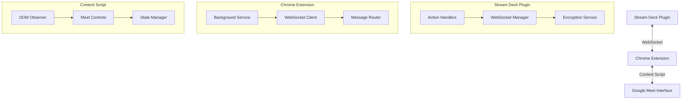
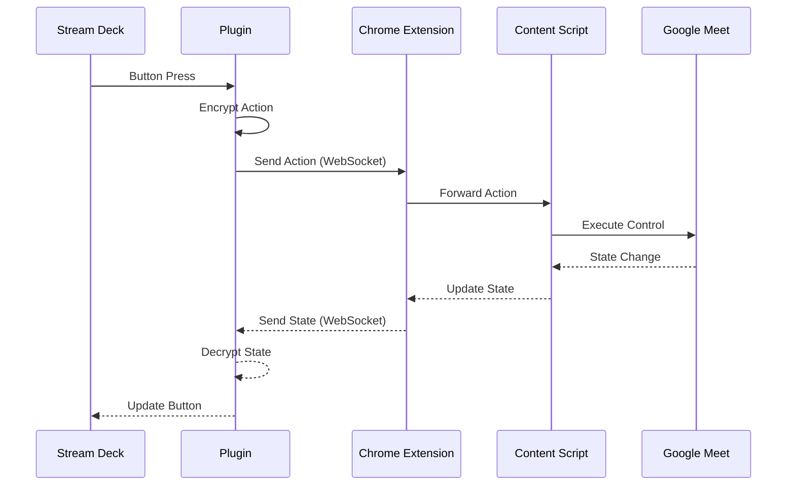

# Kolaborate Google Meet Stream Deck Plugin

This plugin provides seamless control of Google Meet from your Elgato Stream Deck, offering an intuitive physical interface for managing virtual meetings.

## Table of Contents
- [Kolaborate Google Meet Stream Deck Plugin](#kolaborate-google-meet-stream-deck-plugin)
  - [Table of Contents](#table-of-contents)
  - [Features](#features)
    - [Meeting Controls](#meeting-controls)
    - [Technical Features](#technical-features)
  - [Architecture](#architecture)
    - [Component Details](#component-details)
  - [Platform Flow](#platform-flow)
    - [Communication Flow](#communication-flow)
  - [Project Structure](#project-structure)
  - [Installation](#installation)
  - [Development Guide](#development-guide)
    - [Prerequisites](#prerequisites)
    - [Setup](#setup)
  - [Contributing](#contributing)
  - [License](#license)

## Features

Our plugin provides essential controls for Google Meet:

### Meeting Controls
- Mute/unmute audio
- Toggle video on/off
- Raise/lower hand
- Leave meeting

### Technical Features
- Secure WebSocket communication between plugin and Chrome extension
- Encryption service for secure data transmission
- Real-time status updates with visual feedback
- Automatic connection management

## Architecture

The system consists of three main components that work together:



### Component Details

1. **Stream Deck Plugin**
   - Built with the Stream Deck SDK
   - Handles button presses and visual feedback
   - Manages secure WebSocket communication
   - Encrypts all data transmission
   - Provides real-time state updates

2. **Chrome Extension**
   - Acts as a bridge between Stream Deck and Google Meet
   - Background service maintains WebSocket connection
   - Routes messages between components
   - Manages tab state and active meeting detection

3. **Content Script**
   - Directly interacts with Google Meet's interface
   - Observes meeting control states
   - Executes meeting control actions
   - Reports state changes in real-time

## Platform Flow

Here's how the different components interact:



### Communication Flow
1. **User Interaction**
   - User presses a button on the Stream Deck
   - Plugin receives the action event

2. **Action Processing**
   - Plugin encrypts the action
   - Sends via WebSocket to Chrome extension
   - Extension routes to active Google Meet tab

3. **Meet Control**
   - Content script receives action
   - Executes corresponding Meet control
   - Observes state changes

4. **State Updates**
   - Content script detects state changes
   - Reports to extension background service
   - Extension forwards to plugin
   - Plugin updates Stream Deck button state

## Project Structure

The project consists of three main components:

```plaintext
kolaborate-streamdeck-plugin/
├── google-meet-controls/           # Stream Deck Plugin
│   ├── src/
│   │   ├── core/                  # Core services
│   │   │   ├── websocket-manager.ts
│   │   │   └── encryption.ts
│   │   ├── actions/              # Meeting control actions
│   │   │   ├── mute.ts
│   │   │   ├── video.ts
│   │   │   ├── handRaise.ts
│   │   │   └── leave.ts
│   │   └── plugin.ts            # Main entry point
│   │
│   ├── com.elgato.google-meet-controls.sdPlugin/
│   └── package.json
│
├── chrome-extension/              # Chrome Extension
│   ├── manifest.json
│   ├── background.js             # Background service worker
│   └── content.js                # Google Meet interface
│
└── README.md

```

## Installation

1. Install the Chrome extension:
   - Load the `chrome-extension` directory as an unpacked extension in Chrome
   - Enable the extension for Google Meet

2. Install the Stream Deck plugin:
   - Double-click the plugin file in the `google-meet-controls/Release` directory
   - The Stream Deck software will install it automatically

## Development Guide

### Prerequisites
- Node.js and Bun package manager
- Stream Deck Software
- Chrome browser

### Setup
1. Clone the repository
2. Install dependencies:
   ```bash
   cd google-meet-controls
   bun install
   ```

3. Build the plugin:
   ```bash
   bun run build
   ```

4. For development mode:
   ```bash
   bun run dev
   ```

## Contributing

We welcome contributions! Please follow these steps:
1. Fork the repository
2. Create a feature branch
3. Make your changes
4. Add tests if applicable
5. Submit a pull request

## License

MIT License - see [LICENSE](LICENSE) for details.

---

Built with ❤️ by Kolaborate for the African developer community.