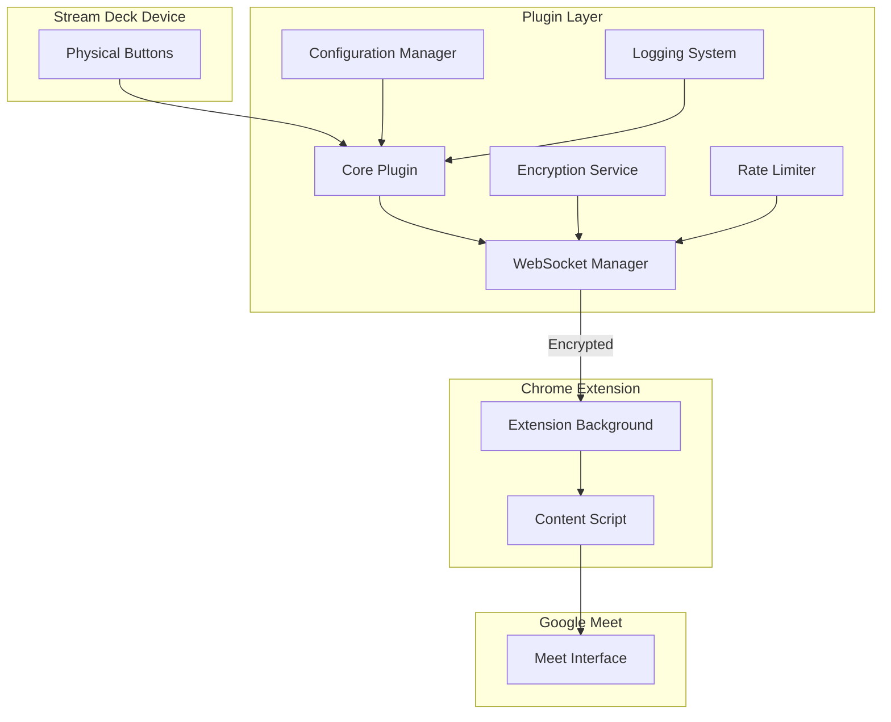
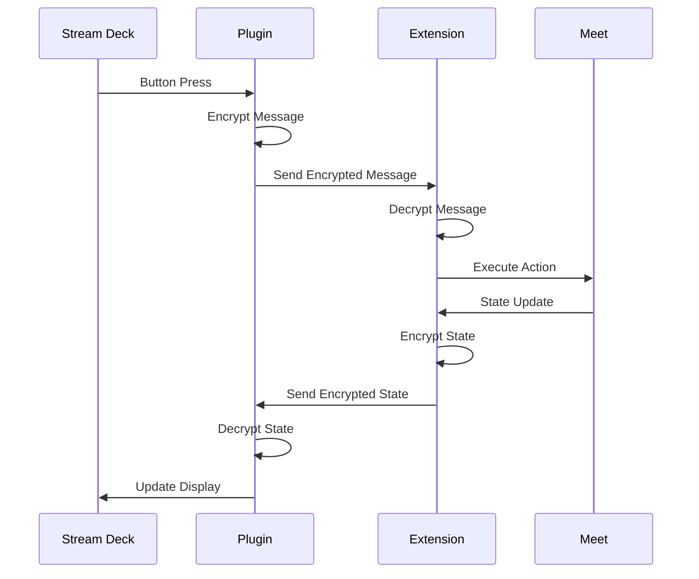

# Kolaborate Google Meet Stream Deck Plugin

This plugin enables seamless control of Google Meet from your Elgato Stream Deck, providing an intuitive physical interface for managing your virtual meetings. 

## Table of Contents
- [Architecture Overview](#architecture-overview)
- [Features](#features)
- [Installation](#installation)
- [Development Setup](#development-setup)
- [Security Features](#security-features)
- [Configuration](#configuration)
- [Troubleshooting](#troubleshooting)
- [Contributing](#contributing)
- [License](#license)

## Architecture Overview

The plugin uses a multi-component architecture to ensure security, reliability, and maintainability:



### Component Interactions

The system consists of four main layers that work together:

1. **Stream Deck Hardware Layer**
   - Handles physical button inputs
   - Provides visual feedback through button displays
   - Manages button state changes

2. **Plugin Layer**
   - Processes button events
   - Manages secure communication
   - Handles configuration and state
   - Core components:
     ```mermaid
     graph LR
         A[Plugin Core] --> B[WebSocket Manager]
         A --> C[Configuration]
         A --> D[Logger]
         B --> E[Encryption]
         B --> F[Rate Limiter]
     ```

3. **Chrome Extension Layer**
   - Bridges plugin and Google Meet
   - Handles browser integration
   - Manages Meet interface interactions

4. **Google Meet Interface Layer**
   - Controls Meet functionality
   - Monitors Meet state
   - Provides real-time feedback

## Features

### Meeting Controls
- One-touch mute/unmute
- Video toggle
- Hand raise/lower
- Chat panel toggle
- Quick meeting join/leave

### Security Features
- End-to-end encryption using AES-256-GCM
- Rate limiting protection
- Secure WebSocket communication
- Origin validation
- Message authentication

### User Experience
- Real-time status updates
- Visual feedback on button states
- Configurable settings via Property Inspector
- Automatic reconnection
- Error recovery

## Installation

### Prerequisites
- Elgato Stream Deck hardware
- Stream Deck software 5.0 or later
- Google Chrome browser
- Node.js 20.x or later

### Plugin Installation
1. Download the latest release
2. Extract to your Stream Deck plugins directory:
   - Windows: \`%appdata%\\Elgato\\StreamDeck\\Plugins\`
   - macOS: \`~/Library/Application Support/com.elgato.StreamDeck/Plugins\`
3. Restart Stream Deck software

### Chrome Extension Installation
1. Open Chrome Extensions page (chrome://extensions)
2. Enable Developer Mode
3. Click "Load unpacked"
4. Select the \`chrome-extension\` directory

## Development Setup

### Environment Setup
1. Clone the repository:
   \`\`\`bash
   git clone https://github.com/kolaborate/streamdeck-googlemeet.git
   cd streamdeck-googlemeet
   \`\`\`

2. Install dependencies:
   \`\`\`bash
   npm install
   \`\`\`

3. Create \`.env\` file:
   \`\`\`env
   NODE_ENV=development
   WEBSOCKET_PORT=12345
   WEBSOCKET_HOST=localhost
   LOG_LEVEL=debug
   \`\`\`

### Building
1. Development build with watch mode:
   \`\`\`bash
   npm run dev
   \`\`\`

2. Production build:
   \`\`\`bash
   npm run build
   \`\`\`

### Project Structure
\`\`\`
kolaborate-streamdeck-plugin/
├── src/
│   ├── core/               # Core functionality
│   │   ├── config.js      # Configuration management
│   │   ├── encryption.js  # Security services
│   │   ├── logger.js      # Logging system
│   │   ├── websocket-manager.js  # Communication
│   │   └── rate-limiter.js      # Rate limiting
│   ├── controllers/        # Business logic
│   │   └── meet-controller.js
│   ├── propertyinspector/ # Settings UI
│   │   ├── index.html
│   │   ├── style.css
│   │   └── index.js
│   └── index.js           # Entry point
├── chrome-extension/      # Chrome extension
├── dist/                 # Built files
└── tests/               # Test suite
\`\`\`

## Security Features

### Encryption Flow


### Security Measures
1. **Message Encryption**
   - AES-256-GCM encryption
   - Secure key generation
   - IV rotation per message

2. **Communication Security**
   - WebSocket with TLS
   - Origin validation
   - Message authentication

3. **Rate Limiting**
   - Request rate monitoring
   - Automatic blocking
   - Configurable thresholds

## Configuration

### Plugin Settings
Settings can be configured through the Property Inspector or environment variables:

| Setting | Environment Variable | Default | Description |
|---------|---------------------|---------|-------------|
| Log Level | LOG_LEVEL | debug | Logging verbosity |
| WS Port | WEBSOCKET_PORT | 12345 | WebSocket port |
| Auto Reconnect | - | true | Auto reconnection |
| Reconnect Delay | - | 5000 | Delay in ms |

### Advanced Configuration
Edit \`config.js\` for advanced settings:

\`\`\`javascript
const config = {
  development: {
    // Development settings
  },
  production: {
    // Production settings
  }
};
\`\`\`

## Troubleshooting

### Common Issues

1. **Connection Issues**
   - Check WebSocket port availability
   - Verify Chrome extension installation
   - Check firewall settings

2. **Button Not Responding**
   - Verify Meet tab is active
   - Check extension permissions
   - Review connection status

3. **State Sync Issues**
   - Clear extension cache
   - Restart Stream Deck software
   - Check debug logs

### Logging

Logs are stored in:
- Windows: \`%appdata%\\Elgato\\StreamDeck\\Plugins\\com.kolaborate.googlemeet\\logs\`
- macOS: \`~/Library/Logs/StreamDeck/com.kolaborate.googlemeet\`

## Contributing

We welcome contributions! Please see our [Contributing Guide](CONTRIBUTING.md) for guidelines.

### Development Process
1. Fork the repository
2. Create a feature branch
3. Make your changes
4. Add tests
5. Submit a pull request

## License

MIT License - see [LICENSE](LICENSE) for details.

---

Built with ❤️ by Kolaborate for the African developer community.