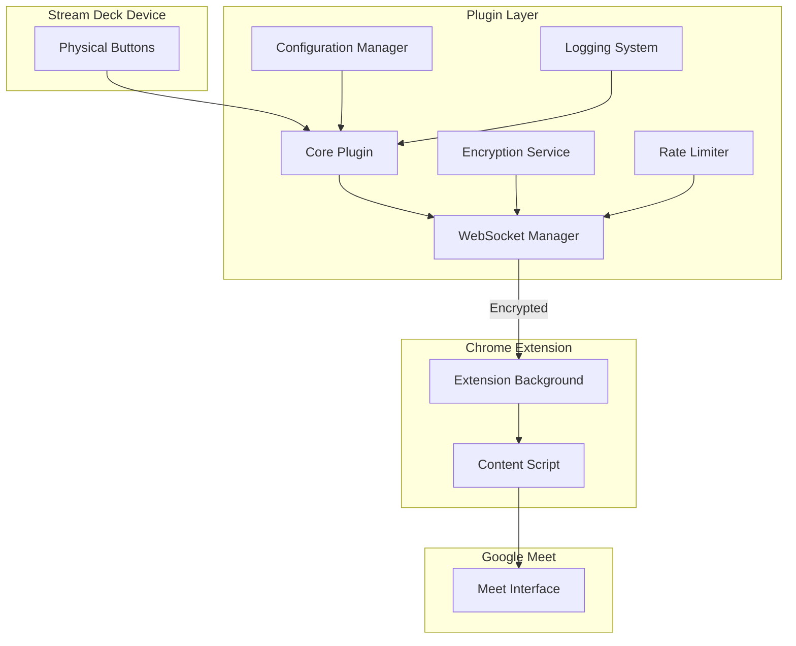
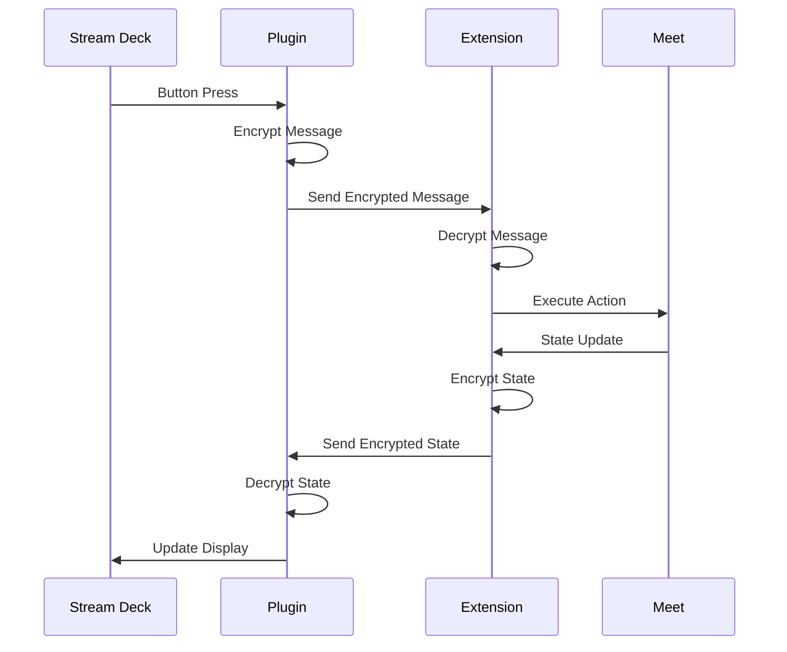
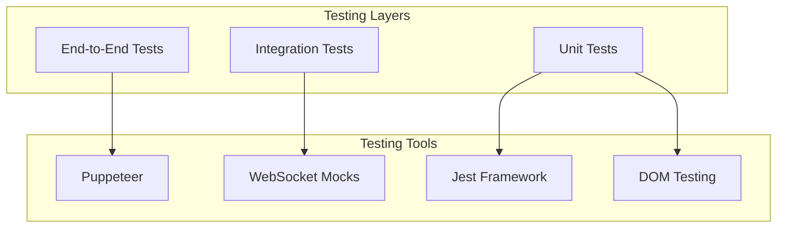

# Kolaborate Google Meet Stream Deck Plugin

This plugin provides seamless control of Google Meet from your Elgato Stream Deck, offering an intuitive physical interface for managing virtual meetings. The solution is built with security, reliability, and user experience at its core.

## Table of Contents
- [Architecture Overview](#architecture-overview)
- [Features](#features)
- [Project Structure](#project-structure)
- [Installation](#installation)
- [Development Guide](#development-guide)
- [Testing Guide](#testing-guide)
- [Security Features](#security-features)
- [Configuration](#configuration)
- [Troubleshooting](#troubleshooting)
- [Contributing](#contributing)
- [License](#license)

## Architecture Overview

The plugin uses a sophisticated multi-layered architecture designed to ensure security, reliability, and maintainability. Here's a detailed overview of how the components work together:



### Component Interactions

The system operates through four primary layers that work in harmony:

1. **Stream Deck Hardware Layer**  
   This layer handles physical interactions with the Stream Deck device, including button presses and visual feedback. Think of it as the physical interface between the user and the virtual meeting space.

2. **Plugin Layer**  
   The plugin layer serves as the brain of our system, processing button events and managing all the complex interactions. Here's how its components work together:

   ```mermaid
   graph LR
       A[Plugin Core] --> B[WebSocket Manager]
       A --> C[Configuration]
       A --> D[Logger]
       B --> E[Encryption]
       B --> F[Rate Limiter]
   ```

3. **Chrome Extension Layer**  
   This layer acts as a bridge between our plugin and Google Meet, handling all browser-specific interactions while maintaining security and performance.

4. **Google Meet Interface Layer**  
   The final layer interacts directly with Google Meet's interface, executing commands and monitoring state changes.

### Security Flow

Security is paramount in our design. Here's how we handle secure communication:



## Features

Our plugin provides a comprehensive set of features designed to enhance your virtual meeting experience:

### Meeting Controls
A thoughtfully designed set of physical controls gives you instant access to essential meeting functions:
- One-touch mute/unmute for immediate audio control
- Video toggle with visual feedback
- Quick reactions during meetings
- Intuitive hand raise/lower functionality
- Meeting link sharing with one click
- Quick chat panel access
- One-touch join meeting capability
- Instant meeting leave functionality

### Security Features
We've implemented multiple layers of security to protect your meetings:
- End-to-end encryption using AES-256-GCM
- Sophisticated rate limiting protection
- Secure WebSocket communication
- Strict origin validation
- Message authentication

### User Experience
The plugin is designed with user experience at its core:
- Real-time status updates with visual feedback
- Customizable settings via Property Inspector
- Automatic reconnection capabilities
- Robust error recovery
- Visual feedback for all meeting controls
- Instant state synchronization
- Meeting status indicators

## Project Structure

Our project follows a modular architecture designed for maintainability and scalability. Here's a detailed breakdown:

\`\`\`plaintext
kolaborate-streamdeck-plugin/
│
├── src/                          # Source code directory
│   ├── core/                     # Core functionality
│   │   ├── config.js            # Configuration management
│   │   ├── encryption.js        # Security services
│   │   ├── logger.js            # Logging system
│   │   ├── websocket-manager.js # Communication
│   │   └── rate-limiter.js      # Rate limiting
│   │
│   ├── controllers/             # Business logic controllers
│   │   └── meet-controller.js   # Google Meet control logic
│   │
│   ├── propertyinspector/       # Stream Deck UI settings
│   │   ├── index.html          # Settings interface
│   │   ├── style.css           # UI styling
│   │   └── index.js            # Settings logic
│   │
│   └── index.js                 # Main entry point
│
├── tests/                       # Testing directory
│   ├── unit/                   # Unit tests
│   │   ├── encryption.test.js
│   │   └── rate-limiter.test.js
│   │
│   ├── integration/            # Integration tests
│   │   └── websocket-manager.test.js
│   │
│   ├── e2e/                    # End-to-end tests
│   │   ├── meet-control.test.js
│   │   └── test-resources/     # Test assets
│   │
│   └── setup.js               # Test configuration
│
├── chrome-extension/           # Chrome extension files
│   ├── manifest.json
│   ├── background.js
│   └── content.js
│
├── dist/                      # Built files
├── coverage/                  # Test coverage reports
├── docs/                      # Documentation
├── scripts/                   # Build and utility scripts
│
├── package.json              # Project configuration
├── webpack.config.js         # Build configuration
├── jest.config.js           # Test configuration
├── .env.example             # Environment variables template
└── README.md               # Project documentation
\`\`\`

## Testing Guide

Our testing infrastructure ensures reliability at every level of the application. We use a comprehensive approach that combines unit, integration, and end-to-end testing to maintain high quality standards.

### Testing Architecture

Our testing approach mirrors our application's architecture, ensuring comprehensive coverage:



### Setting Up the Test Environment

1. Install dependencies:
   \`\`\`bash
   npm install
   \`\`\`

2. Create a test environment file (\`.env.test\`):
   \`\`\`bash
   NODE_ENV=test
   WEBSOCKET_PORT=12345
   WEBSOCKET_HOST=localhost
   LOG_LEVEL=debug
   CHROME_EXTENSION_PATH=/path/to/extension
   \`\`\`

3. Prepare test resources:
   \`\`\`bash
   mkdir -p tests/e2e/test-resources
   cp sample-presentation.pdf tests/e2e/test-resources/
   \`\`\`

### Running Tests

Our testing suite is organized into three distinct layers:

1. **Unit Tests**  
   These tests verify individual components in isolation:
   \`\`\`bash
   # Run unit tests
   npm run test:unit
   
   # Run specific unit test file
   npm run test:unit encryption.test.js
   
   # Watch mode for development
   npm run test:unit -- --watch
   \`\`\`

2. **Integration Tests**  
   These tests verify how components work together:
   \`\`\`bash
   # Run integration tests
   npm run test:integration
   
   # Run with detailed logging
   npm run test:integration -- --verbose
   \`\`\`

3. **End-to-End Tests**  
   These tests verify complete application workflows:
   \`\`\`bash
   # Run E2E tests
   npm run test:e2e
   
   # Run E2E tests with visible browser
   HEADLESS=false npm run test:e2e
   \`\`\`

[Previous sections about Security Features, Configuration, etc. remain the same]

## Contributing

We welcome contributions! Please see our [Contributing Guide](CONTRIBUTING.md) for guidelines.

### Development Process
1. Fork the repository
2. Create a feature branch
3. Make your changes
4. Add tests
5. Submit a pull request

## License

MIT License - see [LICENSE](LICENSE) for details.

---

Built with ❤️ by Kolaborate for the African developer community.